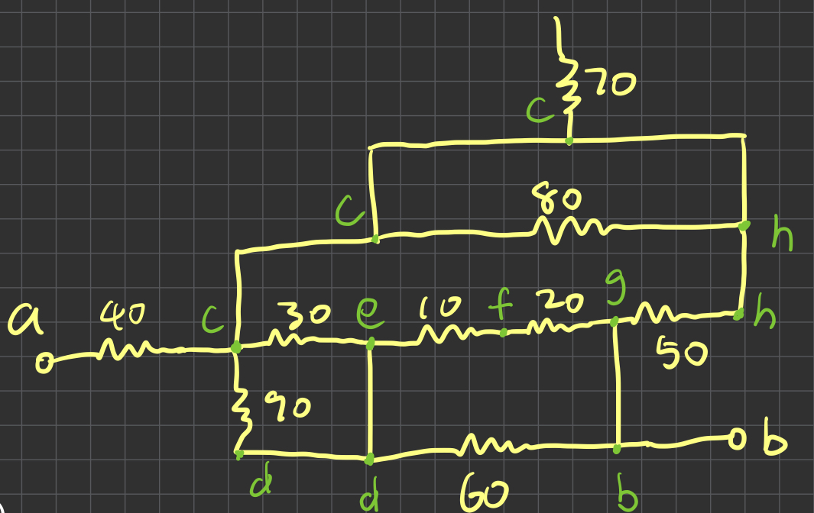

# EquivalentCircuitSimplifier

The EquivalentCircuitSimplifier is a tool designed to assist students in learning how to simplify electrical circuits involving resistors and capacitors. It provides step-by-step solutions to reduce circuits to their equivalent form. This tool is particularly designed for students in the ECE 200 class at NC State University in Spring 2025.

Features
	•	Solves circuits involving resistors and capacitors.
	•	Simplifies circuits by applying appropriate techniques step by step.
	•	Allows users to input circuit connections and terminal points for analysis.

## Usage

To use the tool, you can run the script with the following command:

python main.py --terminals "a,b" --connections "a R-40 c,c R-30 e,c R-90 d,e W d,e R-10 f,f R-20 g,d R-60 b,g W b,g R-50 h,c R-80 h,c R-70 *,c W h"

Arguments
	•	--terminals : Specifies the terminals of the circuit (e.g., "a,b").
	•	--connections : Lists the components and their connections in the circuit (e.g., "a R-40 c,c R-30 e,c R-90 d,e W d,e R-10 f,f R-20 g,d R-60 b,g W b,g R-50 h,c R-80 h,c R-70 *,c W h").

The connections argument should describe the connections between components (resistors, capacitors, wires) in the circuit.

### Example

Given a circuit:



To simplify a circuit with specific connections and terminals, you can run:

```bash
python main.py --terminals "a,b" --connections "a R-40 c,c R-30 e,c R-90 d,e W d,e R-10 f,f R-20 g,d R-60 b,g W b,g R-50 h,c R-80 h,c R-70 *,c W h"
```

This command will simplify the circuit and return the equivalent simplified circuit.

## Contributing

If you’d like to contribute to the project, feel free to fork the repository and submit a pull request. Contributions are welcome!

Let me know if you’d like to adjust or add any further details!